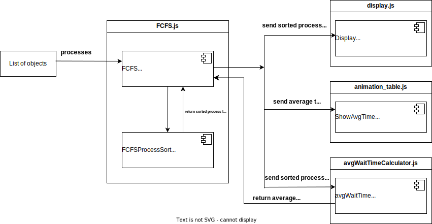

FCFS Scheduling Module
======================

This module implements the **First-Come, First-Served (FCFS)** scheduling algorithm for process scheduling. The FCFS algorithm processes tasks in the order of their arrival.

Module Components
-----------------

The module includes the following functions:

1. **`FCFSProcessSort`**
    * Sorts processes by their start time and calculates their end times based on the FCFS scheduling rules.

2. **`FCFS`**
    *  A higher-level function that sorts the processes, calculates their average waiting time, and displays the results using helper functions `Display` and `ShowAvgTime` and `avgWaitTime`.

Functions Documentation
-----------------------
**FCFSProcessSort**

    `FCFSProcessSort(processes)`

Sorts the given processes by their `start` time and calculates the `endTime` for each process based on its duration and the FCFS scheduling algorithm.

**Parameters:**
    * **processes (list)** `: A list of process objects with the following key properties:`
        **name (str)** `: The name of the process.`

        **start (int or float)** `: The start time of the process.`

        **duration (int or float)** `: The duration of the process.`

**Returns:**
    * **List**: A sorted list of processes **(sorted by start property)** with updated **'endTime'** property values.

**Example:**

  
    **Input:**
          | [
          | { name: "P1", start: 0, duration: 3 },
          | { name: "P2", start: 5, duration: 2 },
          | { name: "P3", start: 10, duration: 1 },
          | ]     
    **Output:**
          | [
          | { name: "P1", start: 0, duration: 3, endTime: 3 },
          | { name: "P2", start: 5, duration: 2, endTime: 7 },
          | { name: "P3", start: 10, duration: 1, endTime: 11 }
          | ]

---------------------------------------------------------------

**FCFS**

    `FCFS(processes)`

Processes the input list of processes using the FCFS algorithm. It sorts the processes, calculates their average waiting time, and displays the results.

**Note:**
This function uses helper functions **`Display`** and **`ShowAvgTime`** and **`avgWaitTime`** to print the details of the scheduled processes and their average waiting time.

**Parameters:**
    * **processes (list)** `: A list of process objects with the same properties as required by `FCFSProcessSort`.`
        **name (str)** `: The name of the process.`

        **start (int or float)** `: The start time of the process.`

        **duration (int or float)** `: The duration of the process.`

**Returns:**
    * None

Diagrams
-----------------------

